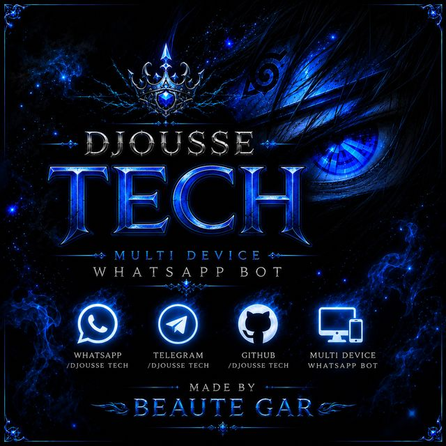

<p align="center">
  
</p>

<h1 align="center">DJOUSSE TECH</h1>

<p align="center">
  <b>Votre Assistant WhatsApp Toujours Avec Vous</b><br>
  Multi-Device WhatsApp Bot • Made with ❤️ by <a href="https://github.com/Beaute-Gar">Beaute Gar</a>
</p>

---

## ✨ Features

- 🤖 **339+ Commandes** — 16 catégories (General, AI, Fun, Games, Economy, Admin, Owner, Media, etc.)
- 🔗 **Multi-Device** — Support WhatsApp Multi-Device (Baileys)
- 💰 **Système Économie** — Daily, Work, Shop, Level Up, Leaderboard
- 🎮 **Jeux** — Quiz, Slots, Tic Tac Toe, Hangman, RPS et plus
- 🛡️ **Anti-Spam** — Protection contre les liens, stickers, tags indésirables
- 🌐 **Site Web** — Dashboard, Panel Admin, Pairing QR Code
- 🤖 **Robot à Émotions** — Un assistant robot avec personnalité et émotions

## 🚀 Démarrage Rapide

### 1. Cloner le dépôt

```bash
git clone https://github.com/Beaute-Gar/DJOUSSE-TECH-MD.git
cd DJOUSSE-TECH-MD
```

### 2. Installer les dépendances

```bash
npm install
```

### 3. Configurer

Créez un fichier `.env` :

```env
SESSION_ID=votre_session_id
BOT_NAME=DJOUSSE TECH
OWNER_NUMBER=237693978044
PREFIX=.
MODE=public
```

### 4. Lancer le bot

```bash
node index.js
```

## 📁 Structure du Projet

```
DJOUSSE-TECH-MD/
├── commands/           # 339+ fichiers de commandes
│   ├── admin/          # Commandes administration
│   ├── ai/             # Intelligence artificielle
│   ├── anime/          # Commandes anime
│   ├── convert/        # Conversion de fichiers
│   ├── economy/        # Système économie
│   ├── fun/            # Divertissement
│   ├── game/           # Jeux
│   ├── general/        # Commandes générales
│   ├── group/          # Gestion de groupes
│   ├── info/           # Informations
│   ├── media/          # Téléchargement média
│   ├── owner/          # Commandes propriétaire
│   ├── security/       # Sécurité
│   ├── sticker/        # Stickers
│   ├── textmaker/      # Effets de texte
│   ├── tool/           # Outils
│   └── utility/        # Utilitaires
├── assets/             # Images du bot
├── database/           # Base de données JSON
├── utils/              # Utilitaires
├── pairing-server/     # Serveur de pairing WhatsApp
├── website/            # Site web (Vercel)
└── index.js            # Point d'entrée
```

## 🌐 Site Web

- **URL** : [djousse-tech-md.vercel.app](https://djousse-tech-md.vercel.app/)
- **Pairing** : [djousse-pairing.onrender.com](https://djousse-pairing.onrender.com)

## 📱 Commandes Populaires

| Commande | Description |
|----------|-------------|
| `.alive` | Statut du bot |
| `.menu` | Liste des commandes |
| `.sticker` | Convertir image en sticker |
| `.daily` | Récompense quotidienne |
| `.work` | Travailler pour gagner des coins |
| `.ai` | Chat intelligent |
| `.translate` | Traduire du texte |
| `.tts` | Texte en speech |

## 👑 Owner

**Beaute Gar** — [GitHub](https://github.com/Beaute-Gar)

## 📄 License

MIT License

---

<p align="center">
  <br><br>
  Made with 💚 by <b>Beaute Gar</b>
</p>
